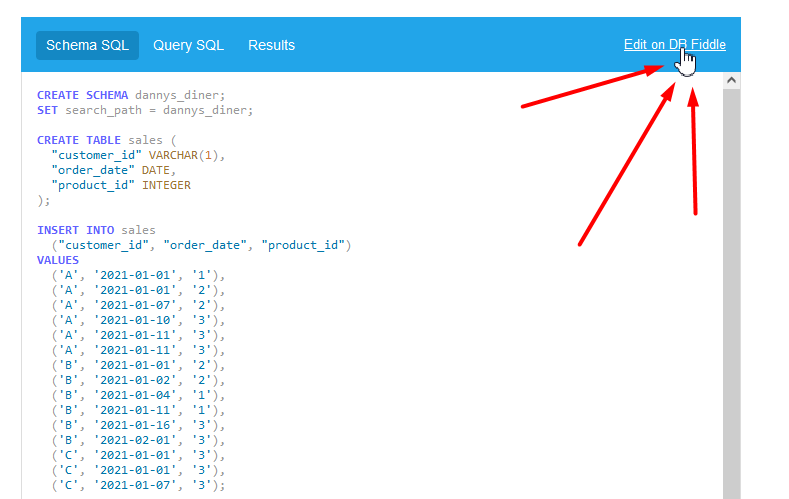

# 8 Week SQL Challenge by Data With Danny - Solutions

This repository contains my solutions for the 8 Week SQL Challenge by Data With Danny.
The challenge is designed to build SQL skills with real-world exercises and
is aimed at data enthusiasts who want to master SQL.

## Table of Contents

1. [**🌟 Introduction**](#-introduction)
1. [**🔥 The Challenge**](#-the-challenge)
1. [**💡 The Solutions**](#-the-solutions)
1. [**💻 Technologies Used**](#-technologies-used)
1. [**🛠 How to Use**](#-how-to-use)
1. [**👌 Acknowledgments**](#-acknowledgments)

## 🌟 Introduction

The 8 Week SQL Challenge is structured to enhance SQL skills progressively, tackling exercises that range from basic to advanced levels. It is a fantastic opportunity to apply SQL in a practical context, involving tasks that you'd typically perform in a data engineering or data analysis role.

## 🔥 The Challenge

1. [**🍽️ Danny's Diner**](https://8weeksqlchallenge.com/case-study-1/)
1. [**🍕 Pizza Runner**](https://8weeksqlchallenge.com/case-study-2/)
1. [**🍲 Foodie Fi**](https://8weeksqlchallenge.com/case-study-3/)
1. [**🏦 Data Bank**](https://8weeksqlchallenge.com/case-study-4/)
1. [**🛒 Data Mart**](https://8weeksqlchallenge.com/case-study-5/)
1. [**🎣 Clique Bait**](https://8weeksqlchallenge.com/case-study-6/)
1. [**🌳 Balanced Tree**](https://8weeksqlchallenge.com/case-study-7/)
1. [**🍊 Fresh Segments**](https://8weeksqlchallenge.com/case-study-8/)

## 💡 The Solutions

1. [**Dannys Diner 🍽️**](Week_001_Dannys_Diner)
1. [**Pizza Runner 🍕**](Week_002_Pizza_Runner)
1. [**Foodie Fi 🍲**](Week_003_Foodie_Fi)
1. [**Data Bank 🏦**](Week_004_Data_Bank)
1. [**Data Mart 🛒**](Week_005_Data_Mart)
1. [**Clique Bait 🎣**](Week_006_Clique_Bait)
1. [**Balanced Tree 🌳**](Week_007_Balanced_Tree)
1. [**Fresh Segments 🍊**](Week_008_Fresh_Segments)

## 💻 Technologies Used

- 🐘 PostgreSQL

## 🛠 How to Use

Each week's folder contains an SQL file that houses the queries for the challenges posed for that week. Simply open the relevant free online Interactive SQL Instance available in each challenge.

## 👌 Acknowledgments

- [**Data With Danny**](https://github.com/DataWithDanny) for creating this excellent SQL challenge.

If you appreciate the content and the challenge, I'd highly recommend considering [**the purchase of the Serious SQL course by Data With Danny**](https://www.datawithdanny.com/). You'll get access to official code solutions, in-depth explanations, extra content and Danny himself is available to answer any SQL questions you might have. It's a great way to deepen your SQL knowledge while supporting the course creator.

If you found this repository helpful, please star ⭐ it to show your support. Thank you! 🙏
